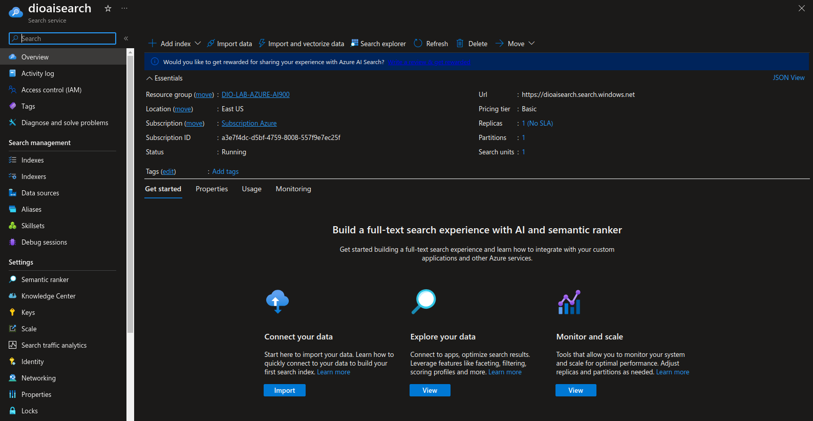
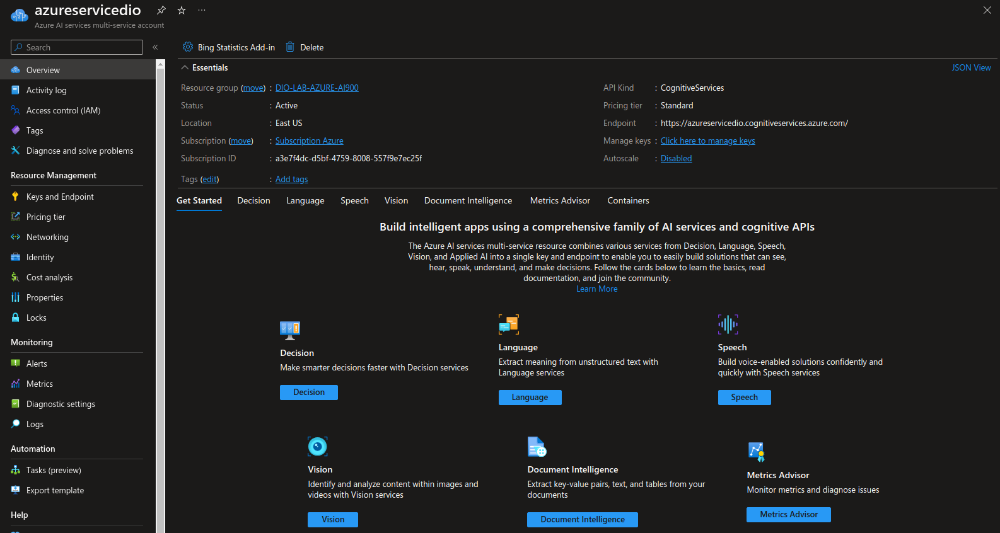
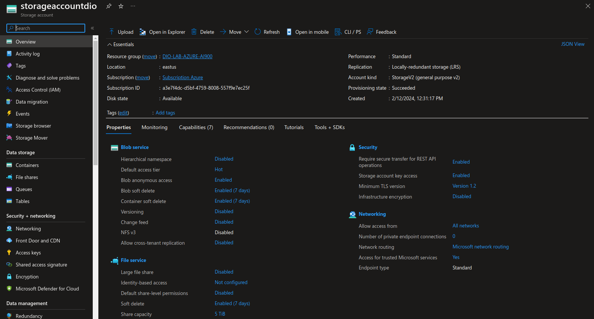
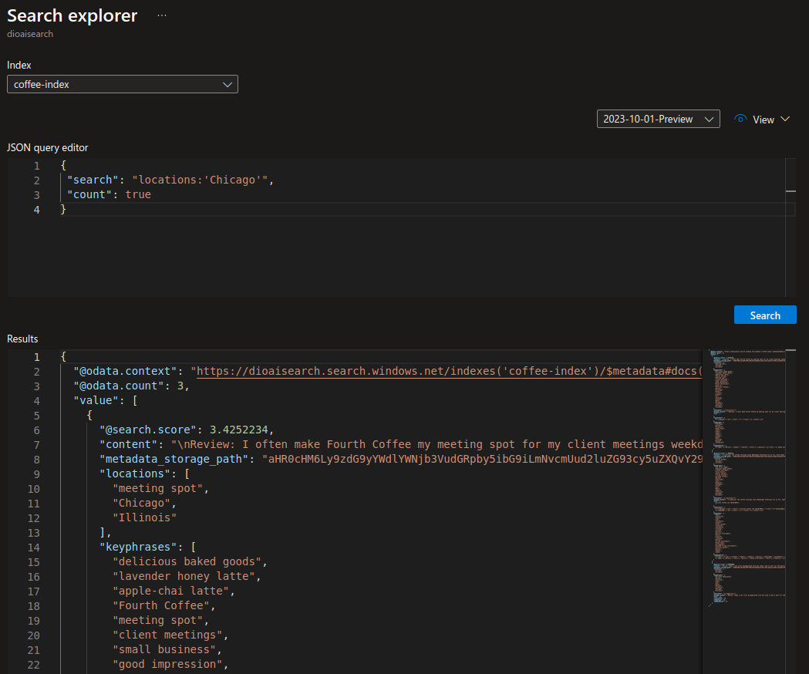
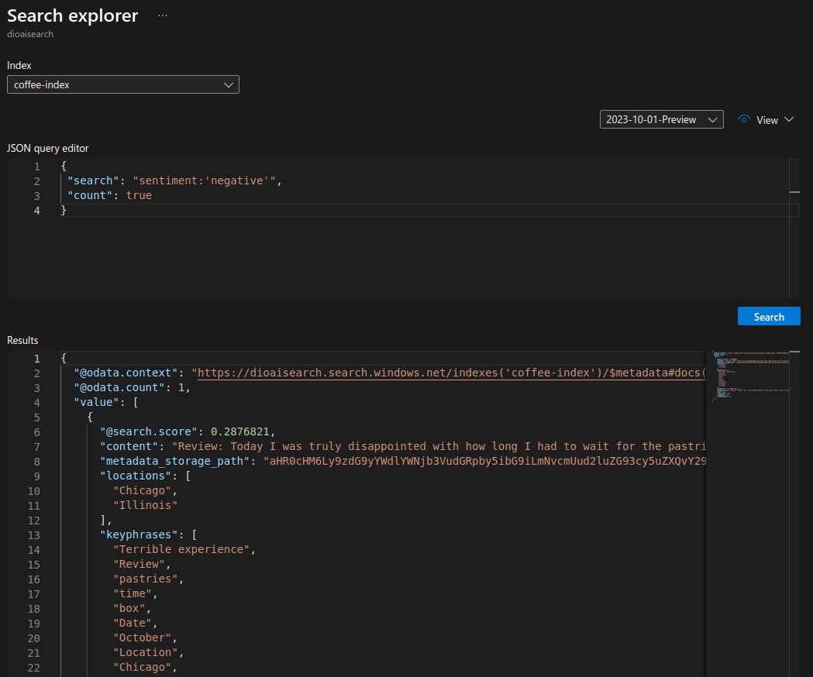
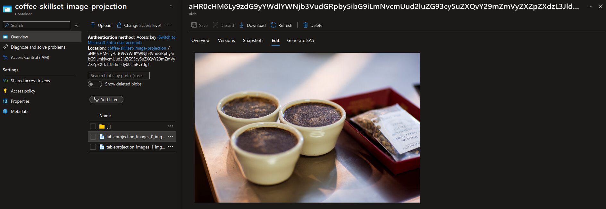
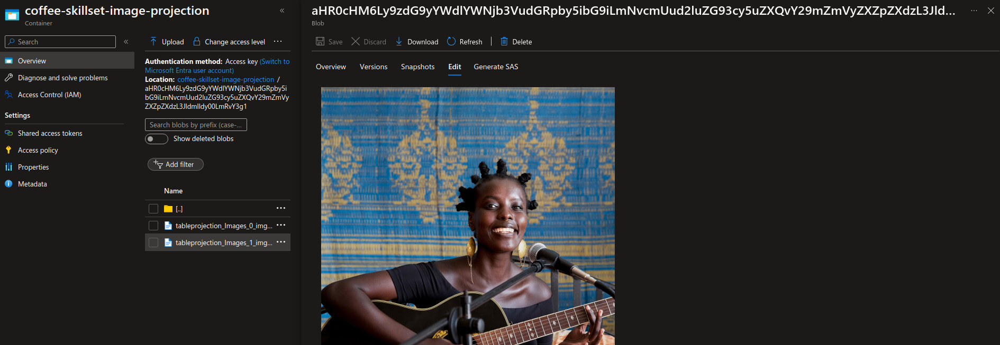

# dio-lab-azure-ai-serarch
Repositório do desafio DIO - Utilizando AI Search para indexação e consulta de Dados

Neste projeto nos trabalhamos na implementação do serviço Azure AI Search para importação, indexação, enrequecimento e consulta de dados. O desafio proposto foi a utilização de 3 serviços do Azure AI Services para realizar a documentos.

## Passos para realização do desafio

- Seguindo o tutorial do [Azure AI Services](https://microsoftlearning.github.io/mslearn-ai-fundamentals/Instructions/Labs/11-ai-search.html).

- Primeiro foi feita a criação de um recurso do Azure AI Search. (Toda a configuração pode ser feita seguindo o passo a passo do tutorial).
- Em seguida, foi feita a criação de um recurso Azure AI services.
- Logo após, foi feita a criação de um recurso Storage account com containers Blob.
- Foi feita a importação de um conjunto de dados para o container Blob de avalição de clientes dos serviços de uma cafeteria.
- Logo em seguida foi feita a criação de um index e um indexador para o conjunto de dados importado.
- Por fim, foi feita a criação de um serviço de pesquisa para consulta dos dados indexados.

### 1. Recurso do Azure AI Search criado

### 2. Recurso do Azure AI Services criado

### 3. Recurso Storage account com containers Blob criado

### 4. Resultado das buscas realizadas no conjunto de dados indexado

Busca textual feita no conjunto de dados, filtrando reviews feitas por clientes de Chicago.

Através do serviço de busca do Azure ele é capaz de detectar a localização do review por meio do texto e colocar isso como uma possibilidade de filtro.

### 5. Resultado das buscas por sentimento realizadas no conjunto de dados indexado

Busca textual feita no conjunto de dados, filtrando por sentimento detectado no texto de forma negativa.

Através do serviço de busca do Azure ele é capaz de detectar também o sentimento do cliente com o texto, se foi um review positivo, nevativo ou neutro e utilizar isso como filtro.

### 6. Geração de imagem através do serviço de busca do Azure

Configurando o enriquecimento de dados é possivel gerar imagens a partir do texto de review do cliente e guardar elas em uma pasta do Storage Account.

